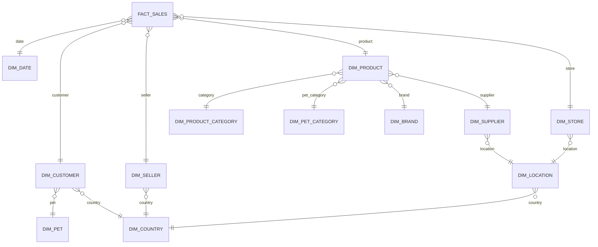

# Pet shop: аналитическая модель PostgreSQL

Перенос продаж зоомагазина из CSV в нормализованную аналитическую модель «снежинка». В качестве исходного набора используются десять файлов из каталога `исходные данные`.

## Разбор CSV

- В каждом файле 1 000 строк и 50 исходных столбцов; вместе — 10 000 строк.
- `id`, `sale_customer_id`, `sale_seller_id` и `sale_product_id` совпадают внутри строки. Значения `id` повторяются от 1 до 1 000 в каждом файле, поэтому сами по себе они не являются уникальными ключами набора.
- Адреса электронной почты покупателей и продавцов в этих данных уникальны. Для связи магазинов и поставщиков с продажами используются их адреса электронной почты.
- Даты заданы в формате `M/D/YYYY`; незаполненные почтовые индексы и штаты сохраняются как `NULL`.
- В источнике нет отдельного стабильного SKU товара. Поэтому атрибуты товара сохраняются в измерении, связанном с исходной строкой; это не создаёт ложных связей между строками только по одинаковому названию товара.

Для каждой загруженной строки создаётся `raw.sale_source.source_row_id`. Этот ключ обеспечивает уникальность строк независимо от повторяющихся исходных `id`.

## Структура

```text
sql/
  00_create_raw.sql       исходная таблица
  01_import_csv.sql       загрузка десяти CSV
  02_create_warehouse.sql измерения и факты
  03_load_warehouse.sql   преобразование и загрузка
  04_report.sql           сверка количества строк и сумм
```

Схема `raw` хранит исходные поля как текст, чтобы загрузка не зависела от формата дат и пустых значений. Схема `dw` содержит таблицу фактов и нормализованные измерения:



`dw.fact_sales` хранит проданное количество и итоговую сумму. В `dw.dim_date` находятся календарные атрибуты, а справочники стран, местоположений и категорий вынесены в отдельные таблицы.

## Запуск

Из корня репозитория:

```bash
docker compose up -d
```

При первом запуске контейнер создаст таблицы и последовательно выполнит SQL-файлы из `sql/`. CSV доступны контейнеру только для чтения.

Параметры подключения:

| Параметр | Значение |
| --- | --- |
| Хост | `localhost` |
| Порт | `5432` |
| База | `pet_shop` |
| Пользователь | `postgres` |
| Пароль | `postgres` |

Инициализационные скрипты PostgreSQL выполняются при создании пустого хранилища. Чтобы повторить загрузку с нуля надо удалить контейнер и volume:

```bash
docker compose down -v
docker compose up -d
```

## Проверка загруженных данных

При первичной инициализации `04_report.sql` печатает количества строк источника и фактов, сверяет строки по ключу загрузки и показывает агрегаты продаж. Те же запросы можно запускать вручную:

```sql
SELECT COUNT(*) AS source_rows FROM raw.sale_source;
SELECT COUNT(*) AS fact_rows FROM dw.fact_sales;

SELECT
    COUNT(*) AS sales,
    SUM(quantity) AS items_sold,
    SUM(total_amount) AS revenue
FROM dw.fact_sales;
```

Для предоставленного набора первые два запроса должны показать значение `10000`.
